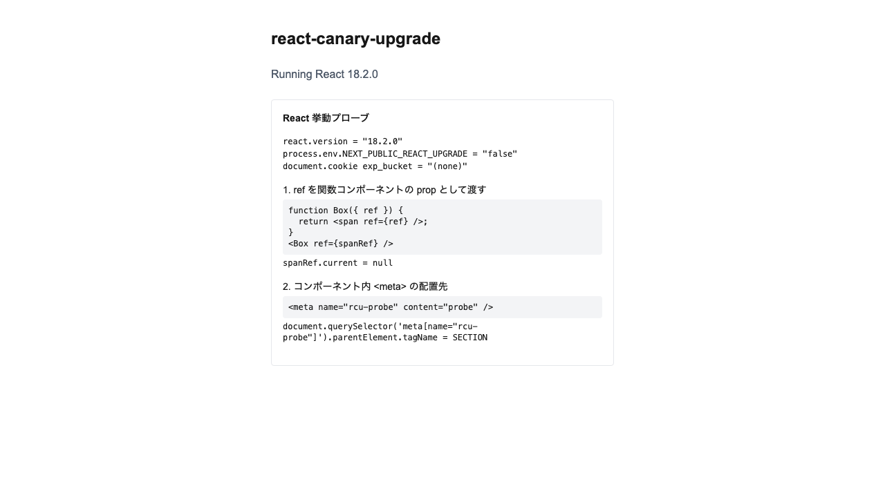
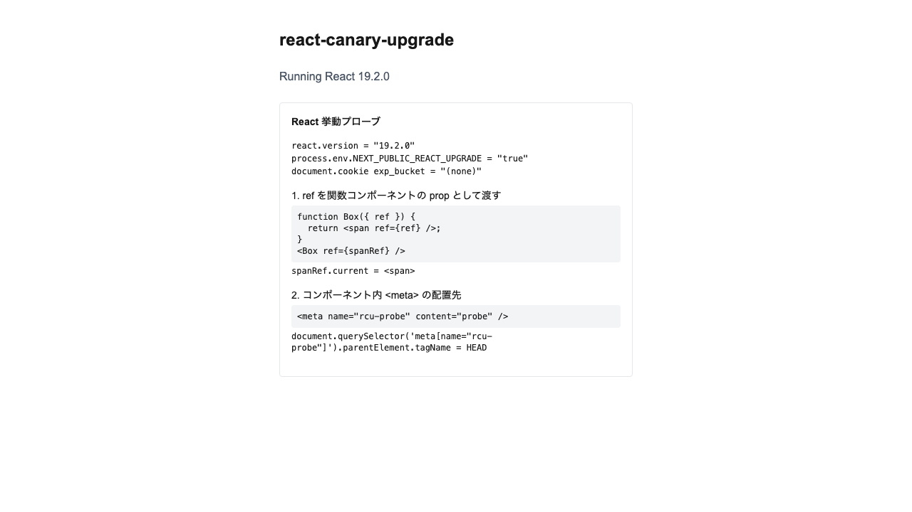

# react-canary-upgrade

Airbnb の記事「[How Airbnb Smoothly Upgrades React](https://medium.com/airbnb-engineering/how-airbnb-smoothly-upgrades-react-b1d772a565fd)」で紹介されている React の段階的アップグレード手法を再現する学習用リポジトリ。
ローカルでの開発から Cloudflare へのデプロイまでを一通りたどる。

手法は二つの層からなる。

**モジュールエイリアシング**は、単一のコードベースから control（React 18）と treatment（React 19）の二つの成果物をビルドする層である。
ビルド時の環境変数 `REACT_UPGRADE` と npm-alias で `react` を差し替え、ソースコードは変更しない。

**トラフィック分割**は、その二つを Cloudflare Containers として並べ、前段の Hono ルーターが cookie で振り分ける層である。
振り分ける割合を変えて段階的にロールアウトし、Web Vitals とエラー率を計測して出荷を判断する。

## ブラウザで動く React の差し替え

同一のコードが、ビルド時の `REACT_UPGRADE` だけでブラウザ実行時の React を切り替える。
クライアントチャンクとハイドレーション後の DOM で確認している。

| | control (`REACT_UPGRADE=false`) | treatment (`REACT_UPGRADE=true`) |
| --- | --- | --- |
| 画面 |  |  |
| 表示される React | 18.2.0 | 19.2.0 |

### 挙動による確認

`BehaviorProbe` は、React 18 から 19 への破壊的変更を実行時に走らせ、流したコードと観測値と実行環境をそのまま画面に表示する。
判定の文言や記号ではなく、生の値を出す。
同一のコードがバージョンの違いだけで観測値を変えるため、18 と 19 が実際に動いていることを示せる。

| 観測対象 | control (React 18) | treatment (React 19) |
| --- | --- | --- |
| `ref` を関数コンポーネントの prop で渡したときの `spanRef.current` | `null` | `<span>` |
| コンポーネント内 `<meta>` の `parentElement.tagName` | `SECTION` | `HEAD` |
| `process.env.NEXT_PUBLIC_REACT_UPGRADE` | `"false"` | `"true"` |

React 19 は `ref` を関数コンポーネントの通常の prop として受け取るため、`spanRef.current` に DOM 要素が入る。
React 18 では `ref` が関数コンポーネントに渡らず、`spanRef.current` は `null` のままになる。
React 19 はコンポーネント内に書いた `<meta>` を `<head>` へ巻き上げるが、React 18 は描画した位置（ここでは `<section>` の中）に残す。

`e2e/visual.spec.ts` が、control を基準画像として treatment のレイアウト一致と、表の観測値を検証する。

## Next.js で React を差し替えるときの注意

App Router は React のランタイムを Next 同梱版（`next/dist/compiled/react`）に固定する。
このため npm-alias でアプリの `react` を差し替えても、実行時の React は変わらない。

そこで本リポジトリは **Pages Router** を採用する。
Pages Router は `node_modules` の React を使うため、webpack の alias（`react$` と `react-dom$` を exact 一致で上書き）でクライアントバンドルの React を 18 と 19 に差し替えられる。

SSR のサーバ側は Next が `react` を externalize するので、bare の react@18 を使う。
ブラウザで動くクライアント側が切り替わることが、この実験の要点である。

control と treatment は別の distDir でビルドする。
distDir を共有すると webpack のキャッシュが混ざり、alias を持たない control が前回の treatment の react を再利用してしまう。

## コマンド

```bash
pnpm dev                 # 開発サーバ
pnpm build:control       # React 18 ビルド
pnpm build:treatment     # React 19 ビルド
pnpm test                # Vitest（インストール済みの React 18 をテスト）
E2E_VARIANT=control   pnpm e2e --update-snapshots   # 基準画像を生成（React 18）
E2E_VARIANT=treatment pnpm e2e                        # 比較と検証（React 19）

# Docker（control=React 18 / treatment=React 19）
docker build --build-arg REACT_UPGRADE=false -t rcu-control .
docker build --build-arg REACT_UPGRADE=true  -t rcu-treatment .
```

## デプロイ（Cloudflare Containers）

```bash
wrangler login
wrangler kv namespace create METRICS   # 出力された id を workers/router/wrangler.jsonc の REPLACE_WITH_KV_ID に設定する
pnpm cf:deploy                          # 両 Docker イメージをビルドして push し、Worker と Containers をデプロイする
```

`SPLIT_PERCENT`（treatment へ振る割合）を変えて再デプロイし、`/stats` で control と treatment を比較しながら段階的にロールアウトする。

## 構成

- `src/pages/`：Pages Router。`_app.tsx` で Web Vitals とエラー収集を起動する。
- `src/lib/vitals.ts`：`web-vitals` を収集して `/beacon` に送る。
- `src/components/BehaviorProbe.tsx`：React 18 と 19 の挙動差を観測して画面に出すプローブ。
- `Dockerfile`：マルチステージ。`ARG REACT_UPGRADE` で control と treatment のイメージを出し分ける（standalone 出力、非 root、tini）。
- `workers/router/`：Hono ルーター。`getContainer()` で振り分け、`/beacon` を KV に集計し、`/stats` で返す。
- `next.config.ts`：`REACT_UPGRADE` による react alias と distDir の切り替え。
